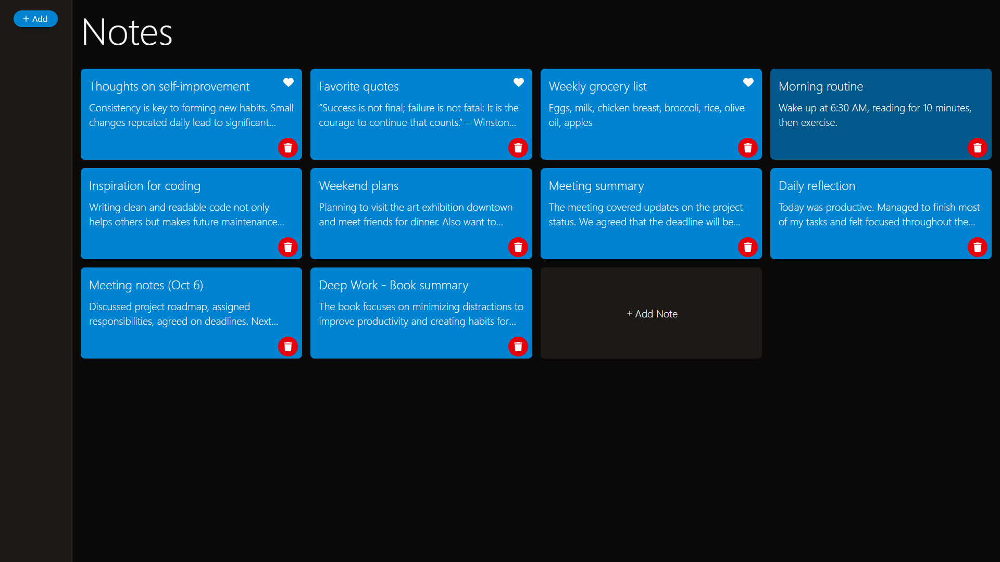
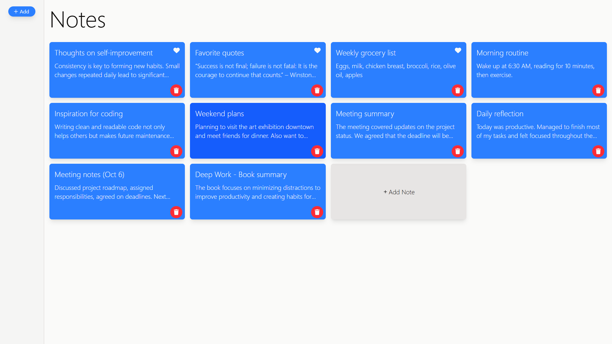

# 📄 Notes app

This is a **MERN stack** web application. This is a simple **CRUD web application** for managing your notes. It allows users to **easily browse, add, and edit notes**. The home page displays the full list of notes.

The project was create using **modern technologies**: the frontend is built with React, TypeScript, and TailwindCSS, while the backend runs on Node.js with the Express.js framework and uses MongoDB as the database.

## ⚙️ Technologies

## ⭐ Key features

- Displaying the list of notes on the home page
- Adding, editing, and deleting notes
- Marking notes as favorites
- Dark mode support
- Responsive design optimized for desktop and mobile devices

## 👀 Preview

_dark mode_

_light mode_

## 🔎 See Also

[My GitHub profile](https://github.com/OKE225)
